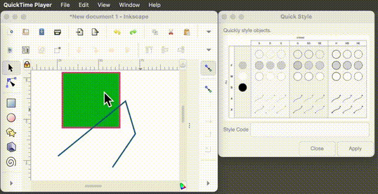

# inkscape-quickstyle

Quickly apply [predefined line styles](#credits) and shape fills to inkscape drawings.

 

## Description

### Purpose
If you ever use Inkscape to draw simple (mostly black-and-white) line-art figures, to accompany mathematics, physics, or engineering writings, you might have struggled when trying to maintain a consistent line and fill style for all your objects, awkwardly adjusting multiple settings to obtain a handfull of line styles (solid, dotted, dashed), thickness (normal, thick, very thick), arrow heads on either, both, or no end, and a few fill settings for shapes (no fill, white, gray, black).

This plugin, which can be left open while drawing, allows to quickly adjust the line and fill styles from a few preset settings by specifying by a text code.

### Text codes

Text codes are short 1- to 3-letter codes made of one or more letters, taken from each line in the following table:


| Attribute        |                  |        |               |       |
| ---              | ---              | ---    | ---           | ---   |
| Stroke style     | solid            | dotted | dashed        |       |
|                  | `s`              | `d`    | `e`           |       |
| Stroke Thickness | normal           | thick  | very thick    |       |
|                  | `default: empty` | `g`    | `h`           |       |
| Arrow heads      | none             | end    | start and end |       |
|                  | `default: empty` | `a`    | `x`           |       |
| Shape Fill       | transparent      | white  | gray          | black |
|                  | `default: empty` | `p`    | `f`           | `b`   |


Source: [G. Castel](https://castel.dev/post/lecture-notes-2/)

### Examples:

| Styling                                                       | Code  |
| ---                                                           | ---   |
| solid line of normal thickness:                               | `s`   |
| solid line of normal thickness with arrow head at the end:    | `sa`  |
| solid line of normal thickness with arrow heads at both ends: | `sx`  |
| object with thick dotted line and gray fill:                  | `dgf` |

## Usage


1. Select an Inkscape object or a group of objects (Bézier drawing, rectangle, ellipse, etc.)
2. Open the `Quick Style...` extension panel (if it is not already open)
3. Enter a `Style Code` in the panel's text field (following Gilles Castel's style conventions codes)
4. Press `Apply` to apply the style to the selected object(s) 


## Installation 

* Copy the files `default-styles-keys2_small.png`, `quickstyle.inx`, and `quickstyle.py` to
```
 ~/Library/Application\ Support/org.inkscape.Inkscape/config/inkscape/extensions/
```
* Restart inkscape.

## Inspiration and Credits
<a id="credits"></a>

This plugin was inspired after attempting to emulate some practices described on Gilles Castel's blog post  
"[How I draw figures for my mathematical lecture notes using Inkscape](https://castel.dev/post/lecture-notes-2/)." As part of his arsenal of tools, he set up an [Inkscape shorcut manager](https://github.com/gillescastel/inkscape-shortcut-manager) through which he manages to adjust styling (line styles, arrows heads, shadings, and more...) just by pressing a few key "chords." This seemed incredibly powerful and infinitely faster than going through Inkscape's intricate styling panels. However, since his approach relied on a shortcut manager that uses `Xlib` for keyboard event interception and I would rather stay away from X11 altogether, adapting the approach on macOS seemed compromised. 

I therefore opted to take bits and pieces of [that shortcut manager](https://github.com/gillescastel/inkscape-shortcut-manager) to build a standalone Inkscape Extension (with Python as the only requirement besides Inkscape).


